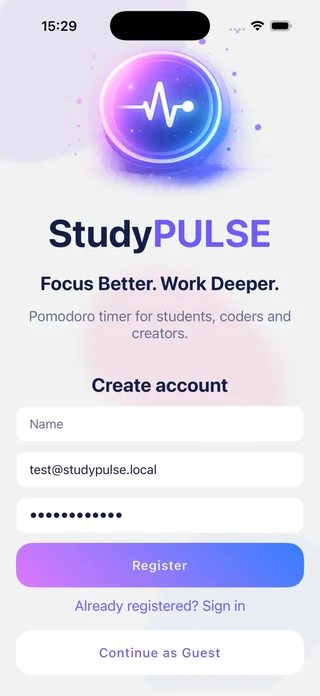
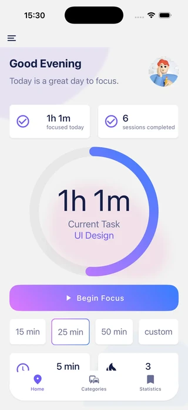
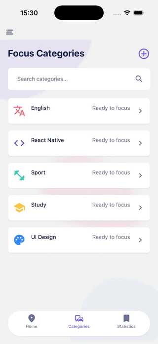
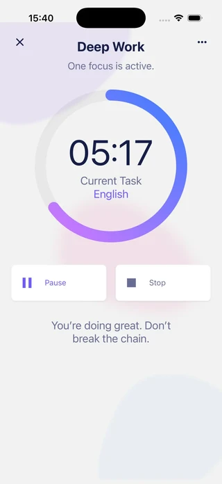
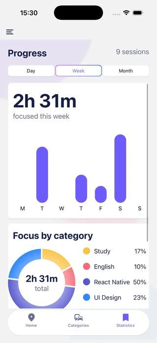
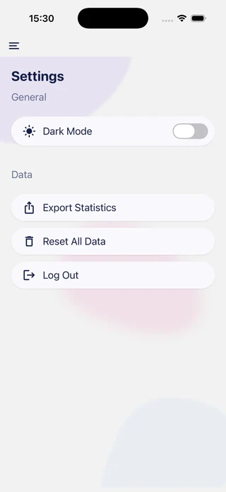
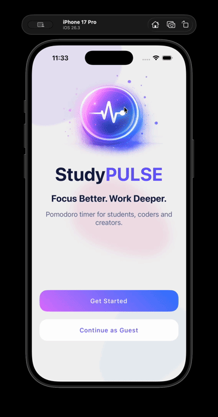
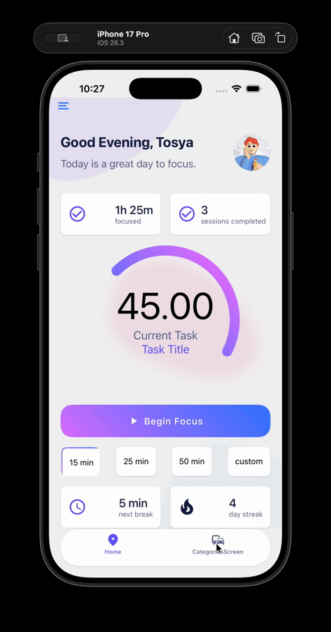
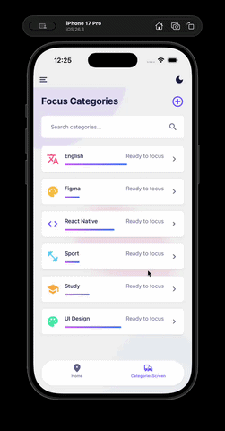
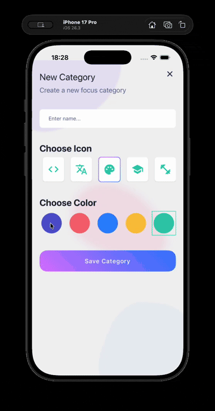

# StudyPulse

[English version](./README.en.md)

StudyPulse - це React Native застосунок для планування навчальних або робочих фокус-сесій. Проєкт починався як MVP з категоріями активностей, а фінальна версія розширена до повнішого productivity app: з авторизацією, offline guest режимом, Pomodoro timer, статистикою, темною/світлою темою та налаштуваннями даних.

## Демо

- Google Drive відео-демо: `https://drive.google.com/file/d/1ulQB5PAchO3BxGQuBPNNN52ObsulkzLg/view?usp=sharing`

## Фінальні скріншоти

Ці місця залишені для фінальних скріншотів перед здачею проєкту.

| Екран                                          | Скріншот                                                             |
| ---------------------------------------------- | -------------------------------------------------------------------- |
| Splash, авторизація і вхід як гість            |      |
| Home з активною фокус-сесією                   |  |
| Список категорій                               |   |
| Pomodoro екран фокусу                          |       |
| Статистика за день/тиждень/місяць              |   |
| Налаштування, експорт, скидання даних і logout |       |

## Наявні демо-матеріали

Попередні демо-файли залишені в репозиторії як історія розвитку застосунку і додаткове підтвердження роботи навігації, списків, Redux та анімацій.









## Основні можливості

- Реєстрація і вхід через email/password у Supabase Auth.
- Персональні дані користувача у Supabase таблицях із Row Level Security.
- Offline guest mode з локальним MMKV сховищем, якщо користувач обирає режим гостя або Supabase недоступний.
- Категорії для фокусу з власною назвою, іконкою і кольором.
- Pomodoro timer з тривалістю 15, 25, 50 хвилин або custom значенням.
- Тільки одна активна фокус-сесія одночасно; вона зберігається в Redux і не скидається після виходу з екрана.
- Start, pause, resume і stop для трекінгу фокусу.
- Збереження сесій зі статусами `completed` і `stopped`.
- Home screen з прогресом за поточний день, активною сесією і швидким стартом фокусу.
- Статистика за день, тиждень і місяць: загальний час фокусу, кількість сесій, графік, розподіл за категоріями, середня сесія, топ-категорія, найкраща година фокусу і streak.
- Settings screen з dark/light mode, CSV export через native share sheet, reset data і logout.

## Відповідність фінальному завданню

### 1. Аналіз наявного застосунку

Початковий MVP був сфокусований на навігації між категоріями і відображенні навчальних активностей. Фінальна версія залишає основний сценарій - обрати категорію і сфокусуватися на ній - але додає повніший продуктовий шар: авторизацію, персональні дані, offline режим, таймер і статистику.

Ключові сценарії користувача:

- Новий користувач реєструється і отримує дефолтні категорії.
- Користувач, який повернувся, логіниться і бачить тільки власні категорії та фокус-сесії.
- Користувач без доступу до мережі може продовжити як гість і зберігати дані локально.
- Користувач запускає Pomodoro, ставить його на паузу, відновлює або зупиняє.
- Користувач переглядає статистику фокусу за день, тиждень або місяць.
- Користувач експортує або скидає власні дані у settings.

Реалізовані зони розширення:

- Backend і прив'язка даних до користувача через Supabase Auth, `user_id` та RLS.
- Offline-first guest flow через MMKV.
- Pomodoro і статистика як основні нові productivity функції.

### 2. Розширення функціоналу

Основна нова функціональність - Pomodoro flow. Екран активної категорії підтримує вибір тривалості, прогрес таймера, pause/resume, stop і збереження сесії. Home screen також розуміє, чи вже є активна фокус-сесія, і відкриває її замість створення дубліката.

Backend розширено з mock/public data до authenticated user data. Категорії та focus sessions тепер прив'язані до конкретного Supabase користувача. Guest mode використовує локальне сховище і не синхронізується з Supabase, щоб поведінка MVP була передбачуваною.

### 3. Рішення щодо state management

Проєкт використовує і Redux Toolkit, і Context API, бо вони розв'язують різні задачі:

- Redux Toolkit зберігає app data, яке використовується на багатьох екранах: auth mode, current user, categories, focus sessions і єдиний active focus timer.
- Theme Context зберігає UI theme state, бо це легкий глобальний стан, який напряму потрібен візуальним компонентам.

Такий поділ робить business data передбачуваними через Redux actions/selectors, а перемикання теми залишається простим для використання з будь-якого компонента.

### 4. Компонентна структура і UX

Застосунок організований на reusable components, screens, navigators, Redux slices, helpers, API functions і local storage helpers. Приклади reusable components: `Button`, `ButtonTimer`, `CategoryItem`, `CategoryList`, `DonutBar`, chart components, `RegistrationForm`, `ThemeToggle`, `Stat` і `UserAvatar`.

Навігація побудована через:

- Stack navigation для входу в застосунок і detail screens.
- Drawer navigation для Home і Settings.
- Bottom tabs для Home, Categories і Statistics.
- Route params для відкриття обраної категорії на active focus screen.

UX покращено через зрозуміліший settings screen, динамічний Home state, збереження активного фокусу, dark/light mode і розділені authenticated/guest flows.

## Архітектура

```text
App
|-- ThemeProvider
|-- Redux Provider
|-- StackNavigation
    |-- SplashScreen
    |-- DrawerNavigation
        |-- Home tabs
        |   |-- HomeScreen
        |   |-- CategoriesScreen
        |   |-- StatisticsScreen
        |-- SettingsScreen
    |-- ActiveCategoryScreen
    |-- AddNewCategoryScreen
|-- FocusTimerHost
```

Потік даних:

```text
Authenticated mode:
React Native UI -> Redux thunks -> Supabase client -> Supabase tables with RLS

Guest mode:
React Native UI -> Redux thunks -> local repository functions -> MMKV
```

Важливі директорії:

- `src/api` - Supabase client і app data API.
- `src/storage` - MMKV guest storage і Supabase auth storage adapter.
- `src/redux/slices` - auth, categories, focus і sessions state.
- `src/helpers` - statistics і CSV helpers.
- `src/navigations` - Stack, Drawer і Tab navigation.
- `src/screens` - основні екрани застосунку.
- `src/components` - reusable UI components.

## Backend і база даних

Основні таблиці:

- `profiles` - один profile на Supabase Auth user.
- `categories` - focus categories, які належать конкретному `user_id`.
- `focus_sessions` - Pomodoro/focus history, яка належить конкретному `user_id` і може бути пов'язана з категорією.

Безпека:

- Row Level Security увімкнено для user-owned tables.
- Authenticated users мають доступ тільки до власних rows.
- Guest mode не пише у Supabase і зберігає дані тільки на пристрої.

Тестові дані:

- Test user: `test@studypulse.local`
- Password: `Password123!`

## Запуск проєкту

Встановити dependencies:

```bash
npm install
```

Встановити iOS pods:

```bash
cd ios
pod install --repo-update
cd ..
```

Запустити Metro:

```bash
npm start
```

Запустити iOS:

```bash
npm run ios
```

Запустити Android:

```bash
npm run android
```

## Перевірка якості

Перевірена команда:

```bash
npm run lint
```

Результат: lint проходить успішно.

## Нотатки для фінальної здачі

Фінальний проєкт покриває потрібні категорії:

- Функціональність: auth, guest/offline mode, Pomodoro, statistics, settings actions.
- Модульність: screens, components, API layer, storage helpers, Redux slices і helpers розділені.
- State management: Redux Toolkit використовується для app data, Theme Context - для UI theme.
- Документація: цей README описує впроваджені зміни, логіку рішень, setup steps і screenshot placeholders.
