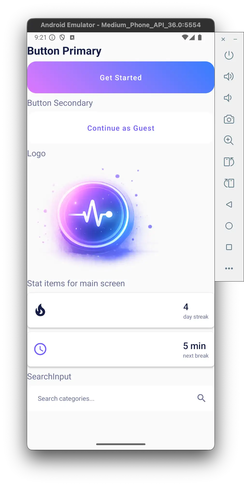
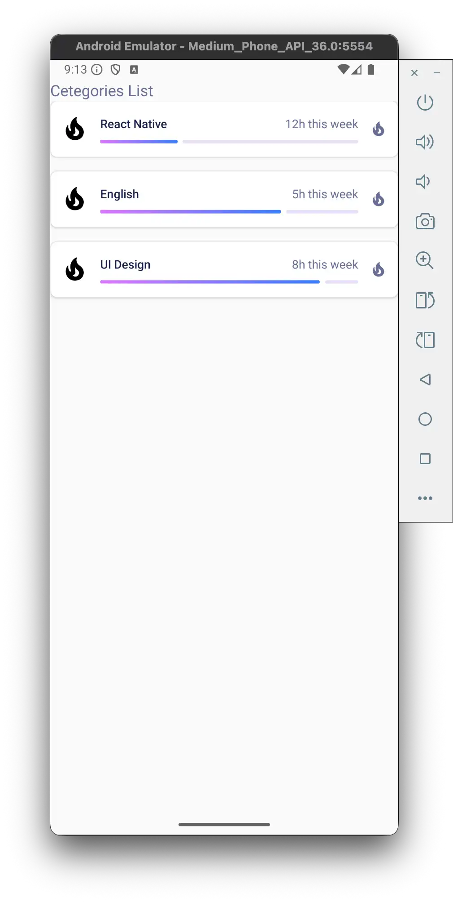
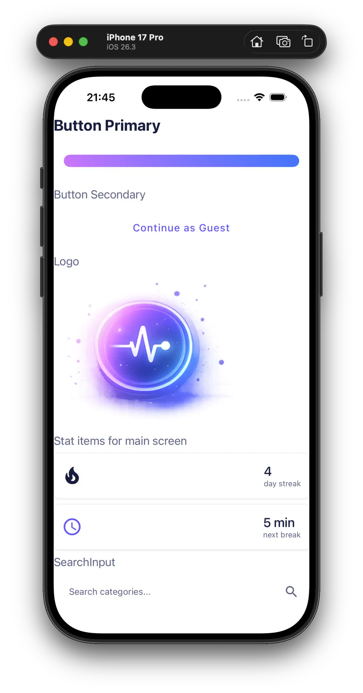
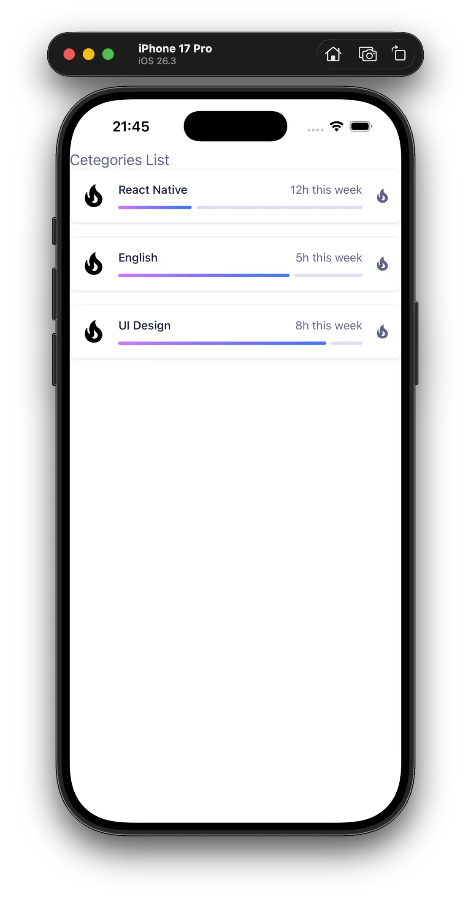

# React Native — Навігація у застосунку

Цей репозиторій містить виконання домашнього завдання з проектування та реалізації навігаційної структури у React Native.

## 🎬 Демонстрація навігації


---

## 🗺 Навігаційна структура

```
App
└── StackNavigator
    ├── SplashScreen              (вхідний екран, replace → HOME)
    └── DrawerNavigator (HOME)
        ├── TabNavigator
        │   ├── HomeScreen        (головний екран)
        │   └── CategoriesScreen  (список категорій)
        └── ActiveCategoryScreen  (деталі категорії, route.params)
```

| Тип навігації      | Де використовується                      |
| ------------------ | ---------------------------------------- |
| `Stack.Navigator`  | Кореневий контейнер + перехід до деталей |
| `Tab.Navigator`    | Головна / Категорії                      |
| `Drawer.Navigator` | Бокове меню застосунку                   |

### Передача даних між екранами

- `CategoriesScreen → ActiveCategoryScreen` через `navigation.navigate(SCREENS.ACTIVE_CATEGORY, { ...task })`
- `ActiveCategoryScreen` отримує дані через `route.params`

---

## 📱 Скриншоти компонентів

**Android:**




**iOS:**




---

## 🛠 Реалізовані компоненти

У проекті виділено та створено наступні ключові компоненти (`src/components/`):

| Компонент      | Опис                                                               |
| -------------- | ------------------------------------------------------------------ |
| `Button`       | Кастомна кнопка (`Pressable` + градієнт через `GradientContainer`) |
| `CategoryItem` | Картка категорії з `DonutBar` прогрес-індикатором                  |
| `CategoryList` | Прокручуваний список (`FlatList`)                                  |
| `SearchInput`  | Поле пошуку (`TextInput`)                                          |
| `Stat`         | Статистика з векторними іконками (`react-native-vector-icons`)     |
| `Container`    | Обгортка з нативними тінями (`Platform.select`)                    |
| `RadioButton`  | Кнопка вибору з градієнтним бордером (`GradientBorder`)            |
| `Logo`         | Адаптивне зображення (`useWindowDimensions`)                       |

---

## ✨ Особливості реалізації

- **Модульність:** Навігаційні стеки у власних файлах (`src/navigations/`)
- **Константи екранів:** `SCREENS.HOME`, `SCREENS.ACTIVE_CATEGORY` тощо (`src/constants/screens.js`)
- **Передача параметрів:** `navigation.navigate()` + `route.params`
- **Стилізація навігації:** `headerShown: false`, кастомні анімації (`CardStyleInterpolators`)
- **replace замість navigate:** `SplashScreen` видаляється зі стеку після переходу
- **Адаптивність:** `useWindowDimensions`, `Platform.select()`, `useSafeAreaInsets`
- **Чистота коду:** Кольори та назви екранів у константах

---

_Домашнє завдання виконано в рамках курсу по React Native._
